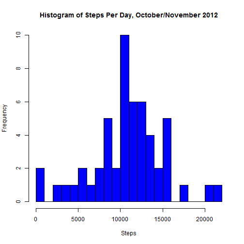
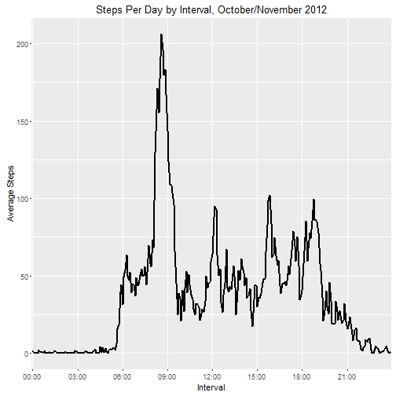
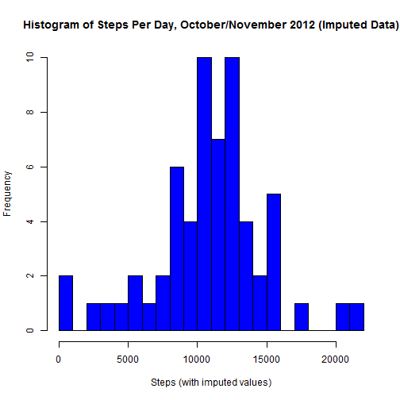
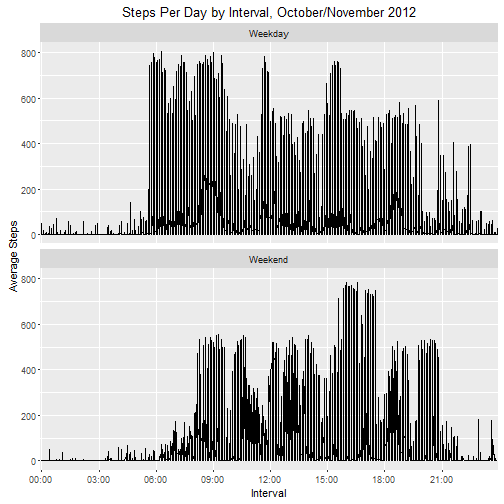

#Activity Monitoring Data Analysis

## For Reproducible Research Week 2

###1. Code for reading in the dataset and/or processing the data 

This first step will take the data from the file "activity.csv" and put it into a data frame suitable for analysis.  Because there is a later step for handling the NA values in the steps variable, I'm not going to do anything with them at this time.

```r
	require(ggplot2,quietly=TRUE)
```

```
## Warning: package 'ggplot2' was built under R version 3.2.5
```

```r
	require(dplyr,quietly=TRUE)
```

```
## Warning: package 'dplyr' was built under R version 3.2.5
```

```
## 
## Attaching package: 'dplyr'
```

```
## The following objects are masked from 'package:stats':
## 
##     filter, lag
```

```
## The following objects are masked from 'package:base':
## 
##     intersect, setdiff, setequal, union
```


```r
	szFilename <- "activity.csv"
	dtaActivity <- read.csv(szFilename)
	dtaActivity$datevalue <- strptime(as.character(dtaActivity$date),
		format="%Y-%m-%d",
		tz="")
```
I'd like to also have a variable that converts the interval into a more readable HH:MM format.  To make things easy with leading zeros, I'm going to add 10000 to the interval value and then take the last 4 characters.

```r
	timevalue <- format(dtaActivity$interval+10000,digits=5)
	timevalue <- paste(substr(timevalue,2,3),substr(timevalue,4,5),sep=":")

	dtaActivity$timevalue <- as.factor(timevalue)
```
I also know that I'll need the day of the week for some of the analysis, so I'm going to create that variable now.

```r
	dtaActivity$dayofweek <- format(dtaActivity$datevalue,format="%A")
```
###2. Histogram of the total number of steps taken each day

For this first pass, I'm going to ignore NA values.  Cleaning those values will be in a later step.  The histogram will be based on the total number of steps per day.  I will first use the *summarize()* function to get the daily totals.

```r
	dtaSteps <- select(dtaActivity,steps,date,timevalue,dayofweek)
	dtaStepsByDate <- summarize(group_by(dtaSteps,date),
		sum(steps))
	names(dtaStepsByDate) <- c("date","steps")
```
Now I will create the histogram.

```r
	hist(dtaStepsByDate$steps,
		breaks=20,
		col="blue",
		main="Histogram of Steps Per Day, October/November 2012",
		xlab="Steps")
```



###3. Mean and median number of steps taken each day
Calculating the mean and median number of steps.

```r
	nStepsMean <- mean(dtaStepsByDate$steps,na.rm=TRUE)
	nStepsMedian <- median(dtaStepsByDate$steps,na.rm=TRUE)
	szStepsMean <- format(round(nStepsMean,2),nsmall=2)
	szStepsMedian <- format(round(nStepsMedian,2),nsmall=2)
```
For this data set, the mean number of data steps per day is 10766.19 and the median is 10765.00.

###4. Time series plot of the average number of steps taken

This time, instead of dates, I need to use intervals to calculate the average number of steps.  I'll use the *summarize()* function again.  One potential problem with the graph is that the intervals are not contiguous values (they go from 55 to 100).  That's why I created the timevalue variable to convert the interval into a HH:MM format and make it a factor.  I'm going to create a new dataframe to group the data by the formatted interval.

```r
dtaStepsByInterval <- summarize(group_by(dtaSteps,timevalue),
		mean(steps,na.rm=TRUE))
	names(dtaStepsByInterval) <- c("interval","steps")
```
Now I'll draw the time-series plot.  Note that in order to get a cleaner plot, I'm going to set breaks on the x-axis for every three hours.

```r
	plotXBreaks <- c("00:00","03:00","06:00","09:00","12:00","15:00","18:00","21:00")

	plotAvgSteps <- ggplot(dtaStepsByInterval,
		aes(x=interval,
		y=steps,
		group=1))
	plotAvgSteps <- plotAvgSteps + geom_line(lwd=1)
	plotAvgSteps <- plotAvgSteps + ggtitle("Steps Per Day by Interval, October/November 2012")
	plotAvgSteps <- plotAvgSteps + xlab("Interval")
	plotAvgSteps <- plotAvgSteps + ylab("Average Steps")
	plotAvgSteps <- plotAvgSteps + scale_x_discrete(breaks=plotXBreaks)

    print(plotAvgSteps)
```



###5. The 5-minute interval that, on average, contains the maximum number of steps

I'll use the *which.max()* function to find which interval has the highest average.

```r
	maxInterval <- dtaStepsByInterval$interval[which.max(dtaStepsByInterval$steps)]
	maxValue <- dtaStepsByInterval$steps[dtaStepsByInterval$interval==maxInterval]
	szMaxValue <- format(round(maxValue,2),nsmall=2)
```
The interval with the highest average is 08:35 with an average value of 206.17.

###6. Code to describe and show a strategy for imputing missing data

In coming up with my strategy, I'd first like to see if there are any patterns for the NA values.  I'm going to analyze the NA values by both date and interval.

```r
	stepsMissingByDate <- table(dtaActivity$date,
		is.na(dtaActivity$steps))

	stepsMissingByInterval <- table(dtaActivity$interval,
		is.na(dtaActivity$steps))

	head(stepsMissingByDate,40)
```

```
##             
##              FALSE TRUE
##   2012-10-01     0  288
##   2012-10-02   288    0
##   2012-10-03   288    0
##   2012-10-04   288    0
##   2012-10-05   288    0
##   2012-10-06   288    0
##   2012-10-07   288    0
##   2012-10-08     0  288
##   2012-10-09   288    0
##   2012-10-10   288    0
##   2012-10-11   288    0
##   2012-10-12   288    0
##   2012-10-13   288    0
##   2012-10-14   288    0
##   2012-10-15   288    0
##   2012-10-16   288    0
##   2012-10-17   288    0
##   2012-10-18   288    0
##   2012-10-19   288    0
##   2012-10-20   288    0
##   2012-10-21   288    0
##   2012-10-22   288    0
##   2012-10-23   288    0
##   2012-10-24   288    0
##   2012-10-25   288    0
##   2012-10-26   288    0
##   2012-10-27   288    0
##   2012-10-28   288    0
##   2012-10-29   288    0
##   2012-10-30   288    0
##   2012-10-31   288    0
##   2012-11-01     0  288
##   2012-11-02   288    0
##   2012-11-03   288    0
##   2012-11-04     0  288
##   2012-11-05   288    0
##   2012-11-06   288    0
##   2012-11-07   288    0
##   2012-11-08   288    0
##   2012-11-09     0  288
```

```r
    head(stepsMissingByInterval,40)
```

```
##      
##       FALSE TRUE
##   0      53    8
##   5      53    8
##   10     53    8
##   15     53    8
##   20     53    8
##   25     53    8
##   30     53    8
##   35     53    8
##   40     53    8
##   45     53    8
##   50     53    8
##   55     53    8
##   100    53    8
##   105    53    8
##   110    53    8
##   115    53    8
##   120    53    8
##   125    53    8
##   130    53    8
##   135    53    8
##   140    53    8
##   145    53    8
##   150    53    8
##   155    53    8
##   200    53    8
##   205    53    8
##   210    53    8
##   215    53    8
##   220    53    8
##   225    53    8
##   230    53    8
##   235    53    8
##   240    53    8
##   245    53    8
##   250    53    8
##   255    53    8
##   300    53    8
##   305    53    8
##   310    53    8
##   315    53    8
```
In looking at the full data set, NA values grouped by date are all or nothing.  In other words, if data is missing, it's missing for an entire day.  Therefore, my strategy to replace missing values will be to take the average interval values for a day of the week like the day missing and replace them. To do so, I first need a dataset that has the average steps per interval for each day of the week.

```r
	dtaStepsDOWInterval <- summarize(group_by(dtaSteps,timevalue,dayofweek),
		mean(steps,na.rm=TRUE))
	names(dtaStepsDOWInterval) <- c("timevalue","dayofweek","impsteps")
```
And now, I'm going to use some code that keeps the original interval step amount if it was a valid value, or replace it with my new data set if it was an NA value.

```r
	dtaImpSteps <- left_join(dtaSteps,dtaStepsDOWInterval)
```

```
## Joining by: c("timevalue", "dayofweek")
```

```r
	dtaImpSteps$steps[is.na(dtaImpSteps$steps)] <- dtaImpSteps$impsteps[is.na(dtaImpSteps$steps)]
```

###7. Histogram of the total number of steps taken each day after missing values are imputed.

Let's draw the histogram chart with the imputed values.

```r
	dtaImpStepsByDate <- summarize(group_by(dtaImpSteps,date),
		sum(steps))
	names(dtaImpStepsByDate) <- c("date","steps")
	hist(dtaImpStepsByDate$steps,
		breaks=20,
		col="blue",
		main="Histogram of Steps Per Day, October/November 2012 (Imputed Data)",
		xlab="Steps (with imputed values)")
```



The difference between this histogram and the other one is that now we're seeing increased frequency in the groupings that previously had all NA values.  I'm going to calculate the mean and median with the imputed data.  Note that I'm not going to use the na.rm=TRUE argument to verify that I'm looking at the imputed values.

```r
	nImpStepsMean <- mean(dtaImpStepsByDate$steps)
	nImpStepsMedian <- median(dtaImpStepsByDate$steps)
	szImpStepsMean <- format(round(nImpStepsMean,2),nsmall=2)
	szImpStepsMedian <- format(round(nImpStepsMedian,2),nsmall=2)
```
Recall that the previous mean and median values were 10766.19 and 10765.00.  The values with the imputed data are 10821.21 and 11015.00.  The values are relatively close, and as a good check, the newer values are higher than the original values.

###8. Panel plot comparing the average number of steps taken per 5-minute interval across weekdays and weekends.

First, I need to create a factor to convert the day of the week to either be a weekday or a weekend.

```r
	typeofday <- dtaImpSteps$dayofweek %in% c("Monday","Tuesday","Wednesday","Thursday","Friday") 
	typeofday[typeofday==TRUE] <- "Weekday"
	typeofday[typeofday==FALSE] <- "Weekend"

	dtaImpSteps$typeofday <- as.factor(typeofday)
```
Now I'll make the two-panel time-series plots.  Note that the example
on GitHub had the facet labels on top, not on the side.  So, I'll use the *facet_wrap()* function on the plot.

```r
	plotDaySteps <- ggplot(dtaImpSteps,
		aes(x=timevalue,
		y=steps,
		group=typeofday))
	plotDaySteps <- plotDaySteps + geom_line()
	plotDaySteps <- plotDaySteps + ggtitle("Steps Per Day by Interval, October/November 2012")
	plotDaySteps <- plotDaySteps + xlab("Interval")
	plotDaySteps <- plotDaySteps + ylab("Average Steps")
	plotDaySteps <- plotDaySteps + scale_x_discrete(breaks=plotXBreaks)
	plotDaySteps <- plotDaySteps + facet_wrap(~typeofday,ncol=1)

    print(plotDaySteps)
```



My first observation with this plot is that steps on the weekday start earlier than steps on the weekend.  This makes sense; the test subject was probably getting ready for work.  My second observation is that there seems to be a relatively higher number of steps later in the day on the weekend than on the weekday.  This also makes sense; the person is probably doing social activities later on the weekend than on a weekday.
